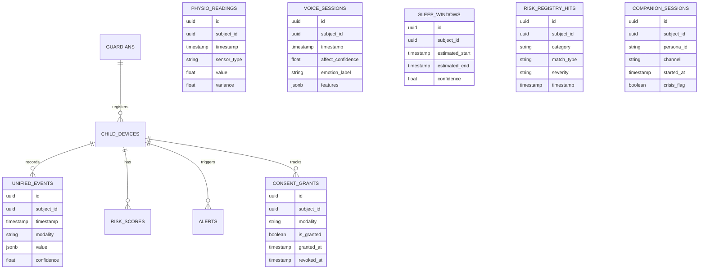

# PRISM — System Architecture & Tech Stack

This document details the high-level architecture, component communication, and technical specifications for the PRISM platform.

---

## 1. High-Level System Architecture

```mermaid
graph TD
    subgraph Clients [Client Layer]
        MobileApp[Mobile App: React Native/Expo]
        WebDashboard[Guardian Dashboard: Next.js/Tailwind]
    end

    subgraph API [API Service Gateway]
        FastAPI[FastAPI Backend]
        AuditLogger[Immutable Audit Log]
    end

    subgraph Queue [Message Broker]
        RedisQueue[(Redis Message Queue)]
    end

    subgraph Analytics [Inference & ML]
        MLEngine[ML Engine Worker: Python/Scikit-Learn]
    end

    subgraph Storage [Database Layer]
        MainDB[(PostgreSQL Database)]
    end

    MobileApp -->|HTTPS + Encrypted Payload (Behavior)| FastAPI
    PRISMNode[PRISM Node: ESP32 IoT / Wearable] -->|MQTT / REST (Physio)| FastAPI
    WebDashboard -->|HTTPS + JWT / RBAC| FastAPI
    FastAPI -->|Log Event| AuditLogger
    AuditLogger -->|Insert Only| MainDB
    FastAPI -->|Enqueue Inference Task| RedisQueue
    RedisQueue -->|Dequeue Task| MLEngine
    MLEngine -->|Write Explanations & Baseline| MainDB
    FastAPI -->|Read Logs & Status| MainDB
```

## 1.5 Unified Event Schema
All telemetry (behavioral and physiological) flows into a single unified event shape:
- `subject_id` (UUID): The monitored child/teen.
- `timestamp` (UTC datetime): Event time.
- `modality` (String): e.g., 'location', 'typing', 'app_usage', 'gsr', 'ppg'.
- `value` (JSON/Float): The specific measurement (e.g., `{"steps": 200}`, `{"gsr_microsiemens": 4.2}`).
- `confidence` (Float): Signal quality (0.0 - 1.0).

---

## 1.6 Entity-Relationship Diagram (ERD)



---

## 2. Tech Stack

### Frontend & Clients
* **Guardian Web Dashboard:** Next.js (React Framework) with Tailwind CSS for layout.
* **Teen & Guardian Mobile App:** React Native + Expo (cross-platform iOS & Android).
* **Charts/Analytics Visualizations:** Recharts or similar Canvas/SVG rendering utilizing tabular-figure sans-serif fonts for accessibility.

### Backend Services
* **Core API Backend:** FastAPI (Python 3.10+). High-performance, asynchronous endpoints.
* **Authentication:** JWT tokens (RS256 signature) stored in HttpOnly secure cookies. Role-Based Access Control (RBAC) enforced on the middleware level.
* **Message Broker:** Redis for job queue management (using Celery or RQ).
* **Database:** PostgreSQL (with TimescaleDB extension if time-series scaling is needed).
* **Immutable Audit Ledger:** Insert-only tables with cryptographic hashing of prior records, or AWS QLDB/similar ledger integration for enterprise deployments.

### Machine Learning Engine
* **ML Inference Worker:** Lightweight Python workers running Scikit-Learn or PyTorch.
* **Signal Capture Specs:**
  * GPS / Accelerometer (Coarse variance, movement patterns, velocity shifts).
  * Keystroke Timing (Inter-key intervals, backspace density, typing speed shifts).
  * App Usage (Categorized durations e.g., Social, Gaming, Study, Productivity).

### Infrastructure
* **Containerization:** Docker multi-stage builds.
* **Orchestration:** Docker Compose (local development & testing) / Kubernetes (production).
* **CI/CD:** GitHub Actions (linting, API endpoint unit tests, container packaging).
* **TLS:** Enforced via reverse proxy (Nginx or Caddy) with TLS 1.3.

---

## 3. NOVA AI Configuration

NOVA chat is served by the FastAPI API at `POST /api/v1/nova/chat` and `GET /api/v1/nova/conversations/{conversation_id}`. Both routes require the existing guardian bearer token and store conversation turns in the existing companion memory tables.

Configure the model only on the backend:

```text
GEMINI_API_KEY=<server-only Gemini API key>
NOVA_AI_MODEL=gemini-2.0-flash
NOVA_AI_TIMEOUT_SECONDS=20
```

Never expose `GEMINI_API_KEY` through `NEXT_PUBLIC_*` variables or the Next.js client.

## 4. Core Security & Privacy Protocols
* **Field-Level Encryption:** Sensitive telemetry data (like latitude/longitude metadata or raw timestamp logs) is encrypted before storage using AES-256-GCM.
* **Immutable Audit Trail:** Any read or write of teen telemetry, or access to guardian screens, writes an audit record immediately.
* **Dual-Consent Sign-off:** No telemetry is collected or processed without active tokens matching the current consent status from both registered Guardian and Teen devices.

---

## 4. Future-Scope Roadmap & Interface Stubs

PRISM includes architectural stubs to support physiological signals, temporal multimodal fusion, and dynamic app registries without schema breakage.

### 4.1 Wearable Ingestion Contract
* **Telemetry Fields:** Heart-rate variability (`hrv_ms`), galvanic skin response (`gsr_microsiemens`), sleep duration (`sleep_duration_seconds`), and sleep quality.
* **Storage:** Mapped to the `PhysiologicalBaseline` database table representing rolling averages and standard deviations.
* **Interface Contract:** Mapped in `WearableIngestionContract` class.

### 4.2 LSTM & Transformer Multimodal Fusion Service
* **Mechanism:** Fuses asynchronous physiological telemetry (e.g., HRV sleep disruptions) with behavioral features (e.g., typing delays, stationary GPS) over sliding temporal windows.
* **Architecture:** Formulates feature vectors fed to deep learning models (RNNs/Transformers) to output attention weights highlighting specific behavioral deviations.
* **Interface Contract:** Mapped in `MultimodalFusionService` class.

### 4.3 Crowdsourced Risk Registry
* **Purpose:** Replaces local static app category list with a dynamic API client query interface checking app packages against crowd-moderated risk databases.
* **Interface Contract:** Mapped in `RiskRegistryProvider` class.
